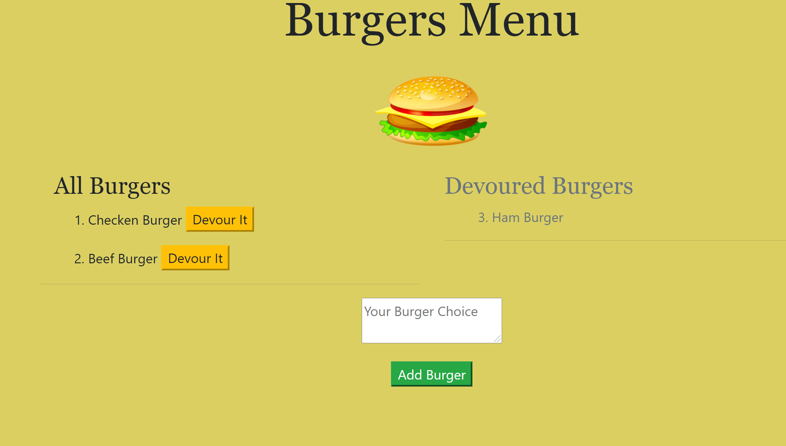

# Eat-Da-Burger!

 
Explore the [project-page](https://github.com/Mgithub89/burger.git)

## Description
  A burger logger app with MySQL,Node,Express,Handlebars and homemade ORM. This App follws the MVC design pattern;uses Node and MySQL to query and route data in the app, and Handlebars to generate the HTML. 
 

## Table Of Contents 
* [Installation](#Installation)
* [Usage](#Usage)
* [Technologies Used](#Technologies-Used)
* [Contributing](#Contributing)
* [Tests](#Tests)
* [License](#License)
* [Questions](#Questions)

## Installation
* install all the dependencies(npm i ...).

## usage
1. Fork the repo 

## Screen Shoot

## Technologies used
* MySQL
* Node
* Express
* Handlebars

## Contributing
* Feel free to contribute. just contact me via email and fork my project

## Tests
* None

## License 
 
 For more information about the License , click on the link below.
 * [License](https://opensource.org/licenses/MIT)

## Questions
* For Questions you can reach me at [metages09@gmail.com](mailto:metages09@gmail.com)
* visit my [github profile](https://github.com/Mgithub89)
        